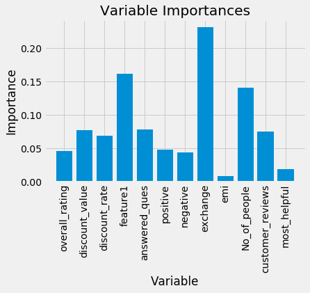

# Analysis of Parameters Influencing Online Product Sales

<h2>Abstract</h2>

Amazon.in is one of the biggest e-commerce marketplace based on revenue and market capitalization. The site gives detailed information on the product and users can rate and review them. This can help other customers to know about the product in the user’s perspective. The attributes such as no. of positive reviews, rating, discount value, exchange offer, discount rate etc. influence the sales of a product. The purpose of our project is to understand and predict the influence of each variable on product sales. 

Using Random Forest Regression the model was trained to predict the sales rank based on the dataset scraped from amazon website. Based on this model we were able to predict the importance of these features.

Firstly, the data is collected by scraping the required parameters. The data which is scraped is stored in a file in .csv format. This data is used as input in the forest regression. It is then trained using the input data and the output which is the sales rank. 

<h3>Dataset</h3>

<h3>Variable Importance</h3>

Our regressor reported an accuracy of approximately 58.5% on the training test (1100 enteries). The original amount of enteries were around 10,000 but we had to remove most of them because they caused the model to give lesser accuracy.

Since the model was trained on a dataset that was raw the accuracy got heavily affected. To improve the accuracy a bit further we had to find out attributes that had very less influence and increased the error in predictions. These attributes were eliminated later using backward elimination

<h3>Conclusion</h3>

Our analysis of the collected data have confirmed that all proposed predictors are influential, promotional marketing strategies and social interactions such as online review and answered questions are both important for influencing sales. Some predictors seem to play a more important role compared to others. Our model also showed that not all the predictors are important as some of them were pruned from during building the model.
