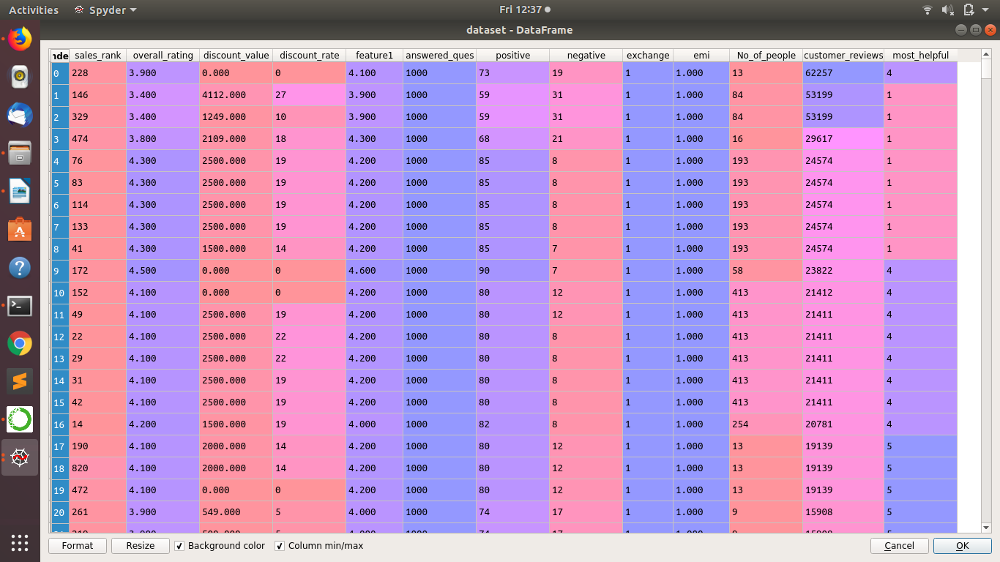

# Analysis of Parameters Influencing Online Product Sales

<h2>Abstract</h2>

Amazon.in is one of the biggest e-commerce marketplace based on revenue and market capitalization. The site gives detailed information on the product and users can rate and review them. This can help other customers to know about the product in the user’s perspective. The attributes such as no. of positive reviews, rating, discount value, exchange offer, discount rate etc. influence the sales of a product. The purpose of our project is to understand and predict the influence of each variable on product sales. 

Using Random Forest Regression the model was trained to predict the sales rank based on the dataset scraped from amazon website. Based on this model we were able to predict the importance of these features.

Firstly, the data is collected by scraping the required parameters. The data which is scraped is stored in a file in .csv format. This data is used as input in the forest regression. It is then trained using the input data and the output which is the sales rank. 

<h3>Dataset</h3>

